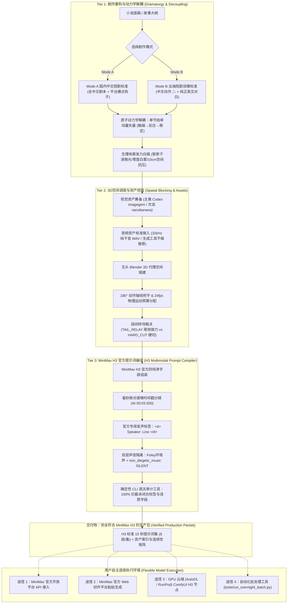

<div align="center">

# 🎬 OmniDirector-H3 (全知导演 H3)
### *专为 MiniMax H3 打造的微短剧剧作重构、3D空间预演与工业级多模态编译系统*
### *The Industrial Screenplay-to-Video Production Engine Specially Engineered for MiniMax H3*

[](LICENSE)
[](https://www.minimaxi.com/)
[%20%7C%20nanobanana-purple.svg)](#-visual--audio-asset-directives--视觉与音频资产工程规范)
[](#-visual--audio-asset-directives--视觉与音频资产工程规范)
[](./AGENTS.md)
[](#-the-dual-production-modes-mode-a--mode-b)
[](#)

---

**About / 简介**：
专为 MiniMax H3 打造的微短剧剧作重构、3D空间预演与工业级多模态编译系统。根除视频大模型肢体融化、镜头越轴跳戏与违禁词误杀，自动化交付电影级分镜提示词与连续性矩阵。
*An industrial-grade screenplay-to-video production pipeline specifically engineered for MiniMax H3. Eliminates diffusion melting, enforces 3D spatial continuity, and compiles broadcast-grade multimodal prompt packets across domestic and global short drama platforms.*

---

[📖 English Docs (README_EN.md)](./README_EN.md) ｜ [🇨🇳 中文技术白皮书 (README_CN.md)](./README_CN.md) ｜ [🤖 Multi-Agent Guide (AGENTS.md)](./AGENTS.md) ｜ [🟣 Claude Code Spec (CLAUDE.md)](./CLAUDE.md)

</div>

---

## 💡 What Does "Omni" Mean? / 为什么叫 Omni？

**"Omni"** (/ˈɒmni/) 源自古罗马拉丁语词根 *omnis*，意为**“全”、“全知全能”、“无所不包的”**（正如哲学中的 *Omniscient* [全知]、*Omnipotent* [全能]，以及英伟达旗下的 *NVIDIA Omniverse* [全宇宙/全维度虚拟仿真平台]）。

在 AI 视频创作中，普通创作者往往只是零散的“写词者（Prompt Typers）”——遇到模型肢体融化、镜头越轴跳戏、台词对不上嘴、模型乱加嘈杂伴奏时束手无策。

而 **OmniDirector（全知导演）** 代表着一种**全维度、全流程掌控的电影工业级总导演体系**：
1. **全模态统筹（Omni-Dimensional）**：将剧作文学、3D 空间几何、24fps 动作动力学、微表情生理体感与 Foley 拟音五维合一；
2. **全场景兼容（Omni-Market）**：原生同时支持 **Mode A（国内中文微短剧）** 与 **Mode B（出海短剧双模标准）**；
3. **全周期连续（Omni-Consistent）**：死守 180° 摄影轴线、道具损伤状态机与 `TAIL_RELAY` 尾帧接力合同，确保多集长视频跨段落永不漂移；
4. **全平台智能体适配（Omni-Agent）**：原生无缝集成 **Claude Code**、**OpenAI Codex**、**Google Antigravity** 与 **Cursor / Windsurf / Cline**。

---

## 🎯 Target Foundation Model: MiniMax H3

**OmniDirector-H3 专为 MiniMax 旗下旗舰级多模态大模型 MiniMax H3 量身定制。**

MiniMax H3 具备强大的原生多模态时序理解与音画协同能力，但对提示词结构的规范性有着极高的工业级要求：
* **原生音画双流架构**：同时驱动画面扩散与精准声线合成；
* **官方毫秒时间戳硬切协议**：通过在 `integrated_multimodal_description:` 中注入绝对递增时间戳（如 `[Shot 2] At 00:03.500...`），在单个 15 秒视频内实现电影级精准分镜硬切；
* **官方 `<d>` 发声标签**：将对白严格封装为 `<d> Speaker: "..." </d>`，确保角色发音时口型与动作丝滑咬合；
* **纯净音频隔离工程**：硬锁 `non_diegetic_music: SILENT`，彻底剔除模型随机生成的恶性电子配乐，为院线级与商业短剧后期混音留出纯净声道。

---

## 🎨 Visual & Audio Asset Directives / 视觉与音频资产工程规范

为保障 MiniMax H3 能够稳定锁脸、锁场景光影与咬合声线，系统制定了明确的前置资产输入标准（详见 [`templates/asset_production_spec.md`](templates/asset_production_spec.md)）：

### 1. 视觉资产生成策略 (Visual Assets)
* 🌟 **首选主推 (Primary Recommended)**：在 **Codex** 中调用 **`imagegem`** 生成。
  * *原因*：深度结合智能体提示词上下文，生成的人物三视图、45° 侧颜及物理光源极度严谨，肤质写实自然，彻底告别廉价塑料 AI 感。
* 🥈 **次选推荐 (Secondary Recommended)**：**`nanobanana`**。
  * *原因*：适合作为高概念场景空镜、极端道具材质与视觉风格概念图的补充生成工具。
* **资产交付标准**：
  * **人物**：中立微表情正面 + 45° 侧脸 + 全身服装锁定照；
  * **场景**：纯无人空镜，锁定主光源朝向与环境冷暖基底；
  * **道具**：纯色底微透视，支持完整损伤状态机（如未拆封 $\rightarrow$ 破损撕开）。

### 2. 音频资产生成策略 (Audio Assets)
* 🔇 **生成工具不做推荐 (No Generator Recommended / Open Choice)**：
  * **本系统对音频生成工具不做任何推荐或绑定**。
  * 无论是真人专业配音员实录干音、开源声线模型（VoxCPM, CosyVoice, GPT-SoVITS, F5-TTS）还是商业配音工具（ElevenLabs），创作者可根据声线拟真度与商用版权完全自选。
* **MiniMax H3 兼容接口参数**：
  * **格式**：无损 **WAV**（单声道 Mono）；
  * **采样率**：**32kHz**（或 44.1kHz / 48kHz）；
  * **纯净度**：**绝对纯干音（Dry Voice）**，禁止带伴奏、底噪与混响（Reverb）；
  * **时长**：5.0 至 15.0 秒，包含 2–3 句带典型语速与情绪起伏的自然台词。
* **视频提示词静音铁律**：视频生成阶段严格锁定 `non_diegetic_music: SILENT`，配乐由成片后期统筹混音。

---

## 🤖 Multi-Platform AI Agent Integration / 多平台智能体适配

OmniDirector-H3 原生支持主流 AI 编程助手与自主智能体平台，开箱即用：

* **Anthropic Claude** (Claude Code / Claude Projects)：内置 [`CLAUDE.md`](./CLAUDE.md)，Claude Code 启动时自动载入所有导演工作流与审计规范；
* **OpenAI Codex** & ChatGPT：提供 [`AGENTS.md`](./AGENTS.md) 专用指令，原生指导 Codex 调用 **`imagegem`** 生产视觉资产；
* **Google Antigravity** (AGY / Gemini CLI)：放入 `.agents/skills/omni-director-h3/`，根目录 [`SKILL.md`](./SKILL.md) 自动注册为系统 Skill；
* **Cursor / Windsurf / Cline**：在 `.cursorrules` 中引入 `AGENTS.md` 规则，实时校验分镜与剧本。

---

## 🏛️ Tri-Tier Core Intelligence Pipeline / 工业三阶全流程智能引擎



---

## 🎭 The Dual Production Modes (Mode A & Mode B)

| 维度 / Mode | Mode A：国内中文微短剧标准 | Mode B：出海微短剧双模标准 |
|---|---|---|
| **目标平台** | 抖音、快手、微信视频号、番茄短剧、红果短剧、爱奇艺微视 | ReelShort、DramaBox、ShortMax、TikTok、ShortWave |
| **动作调度 (`△`)** | 全中文精确白描（高动量、高密度动词因果链） | 全中文精确白描（专为 AI 空间与动量解耦设计） |
| **角色命名** | 地道中文角色名（如：林舟、陆辰、苏晴） | 国际化英文角色名（如：Cade, Reeve, Nia） |
| **对白语言** | 地道中文口语，节奏紧凑、短促有力、强化即时反转 | 纯正美式/国际英语，口语化、含蓄、带停顿与潜台词 |
| **模板文件** | [`templates/screenplay_spec_a_domestic_template.md`](templates/screenplay_spec_a_domestic_template.md) | [`templates/screenplay_spec_b_template.md`](templates/screenplay_spec_b_template.md) |

---

## 📂 Repository Structure / 仓库目录

```
OmniDirector-H3/
├── README.md                          # 旗舰双语介绍主页（本文档）
├── README_CN.md                       # 中文完整技术白皮书
├── README_EN.md                       # 英文完整技术白皮书
├── SKILL.md                           # AI Agent 标准 Skill 规范定义
├── CLAUDE.md                          # Claude Code 原生配置与操作手册
├── AGENTS.md                          # 多平台智能体通用对接规范 (Codex/Antigravity/Cursor)
├── LICENSE                            # MIT 开源许可证
│
├── subskills/                         # 三大核心子技能规范手册
│   ├── 01_screenplay_dramaturgy/      # 剧作重构：Mode A/B 规范与动力学解耦铁律
│   ├── 02_spatial_blocking_audit/     # 3D 空间预演：Blender 预演、180°轴线与连续性合同
│   └── 03_h3_prompt_compiler/         # H3 提示词编译：MiniMax 官方规范、时间戳与标签标准
│
├── templates/                         # 工业生产标准模板库
│   ├── asset_production_spec.md       # 视觉资产 (imagegem/nanobanana) 与音频资产 (32kHz) 规范
│   ├── screenplay_spec_a_domestic_template.md  # Mode A 国内微短剧标准剧本模板
│   ├── screenplay_spec_b_template.md           # Mode B 出海微短剧双模剧本模板
│   ├── h3_prompt_template.md                   # MiniMax H3 官方 15 秒多模态提示词模板
│   └── continuity_contract_template.md         # 跨集资产、转场判定与状态机跟踪表
│
├── tools/                             # 命令行工具集
│   ├── audit_h3_prompts.py            # H3 提示词确定性语法与标签自动化审计器（实测 0 错误）
│   ├── compile_screenplay_to_h3.py   # 剧本快速转 H3 多模态脚手架编译器
│   ├── blender_proxy_previz.py        # 无头 Blender 3D 轴线空间与机位视线校验工具
│   ├── run_overnight_batch.py         # （选配参考）通宵无人值守特惠批处理参考脚本
│   └── push_to_github.sh              # 一键发布至 GitHub 辅助脚本
│
└── examples/                          # 实战验证资产库（E01 完整生产包）
    ├── E01_screenplay_sample.md       # 实战剧本：高张力、强荷尔蒙竞技悬疑
    ├── E01_h3_prompts_sample.md       # 实战编译提示词包（8段全部通过 0 错误审计）
    └── batch_progress_example.json    # 批处理断点状态记录文件范例
```

---

## 🚀 5分钟快速上手

```bash
# 1. 克隆仓库
git clone https://github.com/egguy886/OmniDirector-H3.git
cd OmniDirector-H3
chmod +x tools/*.py tools/*.sh

# 2. 编译剧本为 MiniMax H3 提示词脚手架 (支持 Mode A 或 Mode B)
python3 tools/compile_screenplay_to_h3.py \
  --input templates/screenplay_spec_a_domestic_template.md \
  --output my_episode_prompts.md

# 3. 运行确定性语法审计 (确保 0 语法与标签错误)
python3 tools/audit_h3_prompts.py --input examples/E01_h3_prompts_sample.md

# 4. 运行 Blender 3D 轴线空间预演 (可选)
blender --background --python tools/blender_proxy_previz.py -- --episode E01 --render
```

---

## 📄 License
This project is open-sourced under the **MIT License**. See [LICENSE](LICENSE) for details.
