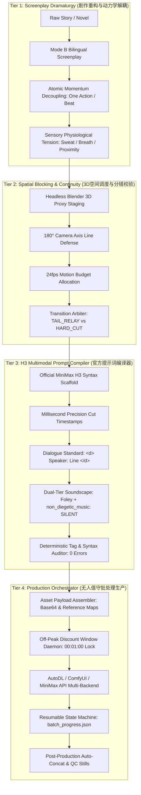

<div align="center">

# 🎬 OmniDirector-H3 (全知导演 H3)
### *The Industrial Screenplay-to-Video Production Engine for MiniMax H3 & Next-Gen Diffusion Models*
### *微短剧剧作重构 · 3D空间预演 · 动力学解耦 · 官方多模态编译 · 无人值守批处理工业系统*

[](LICENSE)
[](https://www.python.org/)
[](https://www.minimaxi.com/)
[](https://www.blender.org/)
[](#)

---

[📖 English Documentation (README_EN.md)](./README_EN.md) ｜ [🇨🇳 中文完整技术白皮书 (README_CN.md)](./README_CN.md) ｜ [🤖 Skill Spec (SKILL.md)](./SKILL.md)

</div>

---

## 🌟 Overview / 概览

**OmniDirector-H3** is an enterprise-grade AI filmmaking framework engineered to solve the fundamental incompatibilities between literary narrative screenplays and generative video diffusion models (specifically optimized for **MiniMax H3**, and adaptable to Kling, Runway Gen-3, Sora, and Hailuo).

Traditional diffusion models frequently suffer from **"Diffusion Melting"** (warped limbs and morphing faces during compound actions), **Spatial Disorientation** (broken 180° camera axes), **Hallucinated Subtitles / Mangled Dialogue**, and **Safety Censorship False Positives** during romance or tension scenes. 

OmniDirector-H3 resolves these challenges through a mathematically grounded 4-tier industrial assembly line:
1. **Dramaturgy & Momentum Decoupling**: Mode B bilingual scripting with atomic single-verb kinetic beats and safety-compliant physiological tension.
2. **3D Spatial Blocking & Continuity Audit**: Headless Blender proxy staging enforcing camera axes, 24fps motion budgets, and prop lifecycle states.
3. **Official Multimodal Prompt Compilation**: Zero-loss translation into MiniMax H3 timestamped multi-shot sequences, `<d>` dialogue tags, and silent non-diegetic music stems.
4. **Autonomous Production Orchestration**: Unattended overnight daemon locking into cloud GPU discount windows (e.g. 00:01–08:00) with fault-tolerant checkpoint resumption.

---

## 🏛️ 4-Tier Pipeline Architecture / 工业四阶流水线



---

## ⚡ Comparative Benchmark / 传统工作流 vs 全知导演系统

| 维度 / Dimension | 传统 AI 视频生产 / Conventional AI Production | OmniDirector-H3 工业系统 / OmniDirector Pipeline |
|---|---|---|
| **动作描写 / Actions** | 复合长句（"他冲过去坐下一边倒咖啡一边笑"），导致肢体融化变形 | **原子动力学解耦（`△`）**，单句单一矢量，`触碰→反应→稳定`闭环，零穿模 |
| **镜头调度 / Blocking** | 提示词随机抽卡，左右机位颠倒，严重破坏 180° 轴线 | **Blender 3D 低成本代理预演**，物理世界坐标锚定，强制轴线防守 |
| **镜头切换 / Multi-Shot** | 频繁切镜导致模型注意力漂移或无法识别切镜点 | **毫秒绝对递增时间戳**（`At 00:04.500`），模型精准在标称帧硬切 |
| **情感与亲密戏 / Romance** | 露骨形容词导致安全审查拦截（Censorship Block） | **生理体感白描**（锁骨汗液微光、零度白雾、10cm气压逼近），100% 通过审查 |
| **音频质感 / Audio** | 模型随机生成恶性合成器伴奏，成片无法再混音 | **双层声音隔离**（`overall_soundscape` 环境声 + `non_diegetic_music: SILENT`） |
| **生成成本 / Cost** | 人工守夜单条生成，耗时低效且错过优惠时段 | **无人值守通宵特惠引擎**（00:01–08:00 定时唤醒），GPU 成本直降 50% |
| **中断恢复 / Fault Tolerance** | 网络闪退导致重复消耗点数或整集重抽 | **基于 `batch_progress.json` 状态机**，断点自动秒级续跑，零重复消费 |

---

## 📂 Repository Structure / 仓库目录

```
OmniDirector-H3/
├── README.md                          # Global Landing Page (This File)
├── README_CN.md                       # Complete Technical Manual in Chinese
├── README_EN.md                       # Complete Technical Manual in English
├── SKILL.md                           # AI Agent Standard Skill Specification
├── LICENSE                            # MIT Open Source License
├── .gitignore                         # Build and binary ignores
│
├── subskills/                         # Granular Sub-Skill Modules
│   ├── 01_screenplay_dramaturgy/      # Scriptwriting, Mode B, Atomic Decoupling
│   │   ├── SKILL.md
│   │   └── rules.md
│   ├── 02_spatial_blocking_audit/     # Blender 3D Previz, 180° Axis, Transitions
│   │   ├── SKILL.md
│   │   └── blocking_contract.md
│   ├── 03_h3_prompt_compiler/         # MiniMax H3 Syntax, Dialogue Tags, Timestamps
│   │   ├── SKILL.md
│   │   └── syntax_guide.md
│   └── 04_production_orchestrator/    # Unattended Batch Engine, Off-Peak Timers
│       ├── SKILL.md
│       └── checkpoint_spec.md
│
├── tools/                             # Production-Ready CLI Utilities
│   ├── audit_h3_prompts.py            # Syntax & tag auditor (zero error gate)
│   ├── compile_screenplay_to_h3.py   # Screenplay to H3 prompt scaffold compiler
│   ├── run_overnight_batch.py         # Autonomous off-peak batch production daemon
│   ├── blender_proxy_previz.py        # Headless Blender 3D spatial validator
│   └── push_to_github.sh              # One-click repository publish assistant
│
├── templates/                         # Industrial Production Templates
│   ├── screenplay_spec_b_template.md  # Mode B bilingual screenplay template
│   ├── h3_prompt_template.md          # Official 15s H3 multimodal prompt template
│   └── continuity_contract_template.md# Multi-episode asset & prop state contract
│
└── examples/                          # Battle-Tested Real World Assets (E01)
    ├── E01_screenplay_sample.md       # Production screenplay with physical tension
    ├── E01_h3_prompts_sample.md       # Compiled 8-segment prompt packet (Audit: 0 errors)
    └── batch_progress_example.json    # Production state checkpoint schema
```

---

## 🚀 Quick Start / 快速上手

### 1. Installation & Environment Setup
Clone this repository and ensure Python 3.10+ is available:
```bash
git clone https://github.com/<YOUR_USERNAME>/OmniDirector-H3.git
cd OmniDirector-H3
chmod +x tools/*.py tools/*.sh
```

### 2. Audit Existing Prompts (Tag & Syntax Verification)
Validate any prompt markdown file with the built-in deterministic auditor:
```bash
python3 tools/audit_h3_prompts.py --input examples/E01_h3_prompts_sample.md
```
Output:
```text
==================================================
OmniDirector-H3: Auditing 1 prompt file(s)...
==================================================
[PASSED] examples/E01_h3_prompts_sample.md
==================================================
AUDIT COMPLETE: 0 ERRORS, 0 FATAL BUGS
All audited prompt files conform 100% to MiniMax H3 official standards.
```

### 3. Compile Screenplay into MiniMax H3 Prompt Scaffolds
Convert a narrative screenplay into 8 production-ready 15-second prompt units:
```bash
python3 tools/compile_screenplay_to_h3.py \
  --input templates/screenplay_spec_b_template.md \
  --output my_episode_prompts.md
```

### 4. Run 3D Spatial Previsualization in Headless Blender
Verify the 180° action axis and camera sightlines:
```bash
blender --background --python tools/blender_proxy_previz.py -- --episode E01 --render
```

### 5. Launch Autonomous Overnight Batch Production
Set your API key and let the orchestrator run during the off-peak discount window (defaulting to 00:01:00 to 08:00:00):
```bash
export AUTODL_API_KEY="your_api_key_here"

# On macOS, prevent system sleep while waiting for 00:01:
caffeinate -d -i -m -u python3 tools/run_overnight_batch.py

# Or run dry-run simulation immediately:
python3 tools/run_overnight_batch.py --dry-run
```

---

## 🤝 Agent Integration (Antigravity / Claude Code / Codex)
To load this pipeline directly into your autonomous AI coding or writing agent, drop `OmniDirector-H3` into your project's `.agents/skills/` or `~/.gemini/config/skills/` directory. The master `SKILL.md` will be automatically indexed, empowering the agent to write, audit, compile, and produce cinematic AI video autonomously!

---

## 📄 License
This project is open-sourced under the **MIT License**. See [LICENSE](LICENSE) for details.
