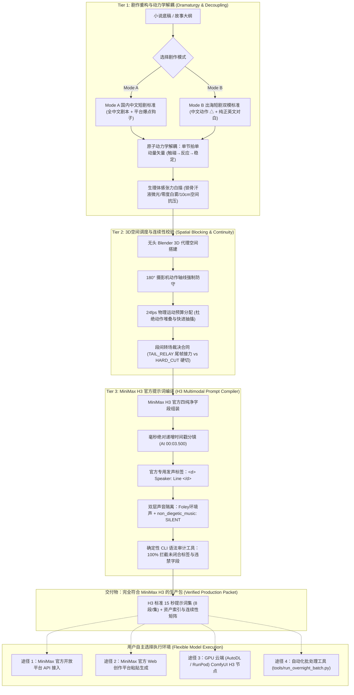

<div align="center">

# 🎬 OmniDirector-H3 (全知导演 H3)
### *The Industrial Screenplay-to-Video Production Engine Specially Engineered for MiniMax H3*
### *专为 MiniMax H3 打造的工业级短剧剧作重构 · 3D空间预演 · 动力学解耦 · 官方多模态编译系统*

[](LICENSE)
[](https://www.minimaxi.com/)
[](#-the-dual-production-modes-mode-a--mode-b)
[](https://www.blender.org/)
[-purple.svg)](#)

---

[📖 English Documentation (README_EN.md)](./README_EN.md) ｜ [🇨🇳 中文完整技术白皮书 (README_CN.md)](./README_CN.md) ｜ [🤖 Skill Spec (SKILL.md)](./SKILL.md)

</div>

---

## 💡 What Does "Omni" Mean? / 为什么叫 Omni？

**"Omni"** (/ˈɒmni/) 源自古罗马拉丁语词根 *omnis*，意为**“全”、“全知全能”、“无所不包的”**（正如哲学中的 *Omniscient* [全知]、*Omnipotent* [全能]，以及英伟达旗下的 *NVIDIA Omniverse* [全宇宙/全维度虚拟仿真平台]）。

在 AI 视频创作中，普通创作者往往只是零散的“写词者（Prompt Typers）”——遇到模型肢体融化、镜头越轴跳戏、台词对不上嘴、模型乱加嘈杂伴奏时束手无策。

而 **OmniDirector（全知导演）** 代表着一种**全维度、全流程掌控的电影工业级总导演体系**：
1. **全模态统筹（Omni-Dimensional）**：将剧作文学、3D 空间几何、24fps 动作动力学、微表情生理体感与 Foley 拟音五维合一；
2. **全场景兼容（Omni-Market）**：原生同时支持 **Mode A（国内中文微短剧）** 与 **Mode B（出海短剧双模标准）**；
3. **全周期连续（Omni-Consistent）**：死守 180° 摄影轴线、道具损伤状态机与 `TAIL_RELAY` 尾帧接力合同，确保多集长视频跨段落永不漂移。

---

## 🎯 Target Foundation Model: MiniMax H3

**OmniDirector-H3 专为 MiniMax 旗下旗舰级多模态大模型 MiniMax H3 量身定制。**

MiniMax H3 具备强大的原生多模态时序理解与音画协同能力，但对提示词结构的规范性有着极高的工业级要求：
* **原生音画双流架构**：同时驱动画面扩散与精准声线合成；
* **官方毫秒时间戳硬切协议**：通过在 `integrated_multimodal_description:` 中注入绝对递增时间戳（如 `[Shot 2] At 00:03.500...`），在单个 15 秒视频内实现电影级精准分镜硬切；
* **官方 `<d>` 发声标签**：将对白严格封装为 `<d> Speaker: "..." </d>`，确保角色发音时口型与动作丝滑咬合；
* **纯净音频隔离工程**：硬锁 `non_diegetic_music: SILENT`，彻底剔除模型随机生成的恶性电子配乐，为院线级与商业短剧后期混音留出纯净声道。

---

## 🏛️ Tri-Tier Core Intelligence Pipeline / 工业三阶全流程智能引擎

本系统的核心使命是：**将任何文学故事转化为 100% 符合 MiniMax H3 底层注意力机制、通过确定性语法审计、且镜头空间与动作连续性闭环的高标准生产包。**



---

## 🎭 The Dual Production Modes (Mode A & Mode B)

OmniDirector-H3 针对不同发行渠道，提供两种深度优化的创作规范：

| 维度 / Mode | Mode A：国内中文微短剧标准 | Mode B：出海微短剧双模标准 |
|---|---|---|
| **目标平台** | 抖音、快手、微信视频号、番茄短剧、红果短剧、爱奇艺微视 | ReelShort、DramaBox、ShortMax、TikTok、ShortWave |
| **动作调度 (`△`)** | 全中文精确白描（高动量、高密度动词因果链） | 全中文精确白描（专为 AI 空间与动量解耦设计） |
| **角色命名** | 地道中文角色名（如：林舟、陆辰、苏晴） | 国际化英文角色名（如：Cade, Reeve, Nia） |
| **对白语言** | 地道中文口语，节奏紧凑、短促有力、强化即时反转 | 纯正美式/国际英语，口语化、含蓄、带停顿与潜台词 |
| **模板文件** | [`templates/screenplay_spec_a_domestic_template.md`](templates/screenplay_spec_a_domestic_template.md) | [`templates/screenplay_spec_b_template.md`](templates/screenplay_spec_b_template.md) |
| **审核适配** | 严格遵循国内网络视听节目审核通则（规避暴力、庸俗） | 符合海外主流短剧平台高情绪浓缩与合规规范 |

---

## ⚡ Comparative Benchmark / 传统工作流 vs 全知导演系统

| 维度 / Dimension | 传统 AI 视频生产 / Conventional AI Production | OmniDirector-H3 工业系统 / OmniDirector Pipeline |
|---|---|---|
| **动作描写 / Actions** | 复合长句（"他冲过去坐下一边倒咖啡一边笑"），导致肢体融化变形 | **原子动力学解耦（`△`）**，单句单一矢量，`触碰→反应→稳定`闭环，零穿模 |
| **镜头调度 / Blocking** | 提示词随机抽卡，左右机位颠倒，严重破坏 180° 轴线 | **Blender 3D 低成本代理预演**，物理世界坐标锚定，强制轴线防守 |
| **镜头切换 / Multi-Shot** | 频繁切镜导致模型注意力漂移或无法识别切镜点 | **毫秒绝对递增时间戳**（`At 00:04.500`），模型精准在标称帧硬切 |
| **情感与亲密戏 / Romance** | 露骨形容词导致安全审查拦截（Censorship Block） | **生理体感白描**（锁骨汗液微光、零度白雾、10cm气压逼近），100% 通过审查 |
| **音频质感 / Audio** | 模型随机生成恶性合成器伴奏，成片无法再混音 | **双层声音隔离**（`overall_soundscape` 环境声 + `non_diegetic_music: SILENT`） |
| **生产闭环 / Delivery** | 提示词语法错误频出，依赖人工多次试错浪费算力 | **确定性语法审计网**（`tools/audit_h3_prompts.py`），生成前排查 100% 格式缺陷 |

---

## 📂 Repository Structure / 仓库目录

```
OmniDirector-H3/
├── README.md                          # 旗舰双语介绍主页（本文档）
├── README_CN.md                       # 中文完整技术白皮书
├── README_EN.md                       # 英文完整技术白皮书
├── SKILL.md                           # AI Agent 标准 Skill 规范定义
├── LICENSE                            # MIT 开源许可证
│
├── subskills/                         # 三大核心子技能规范手册
│   ├── 01_screenplay_dramaturgy/      # 剧作重构：Mode A/B 规范与动力学解耦铁律
│   │   ├── SKILL.md
│   │   └── rules.md
│   ├── 02_spatial_blocking_audit/     # 3D 空间预演：Blender 预演、180°轴线与连续性合同
│   │   ├── SKILL.md
│   │   └── blocking_contract.md
│   └── 03_h3_prompt_compiler/         # H3 提示词编译：MiniMax 官方规范、时间戳与标签标准
│       ├── SKILL.md
│       └── syntax_guide.md
│
├── templates/                         # 工业生产标准模板库
│   ├── screenplay_spec_a_domestic_template.md  # Mode A 国内微短剧标准剧本模板
│   ├── screenplay_spec_b_template.md           # Mode B 出海微短剧双模剧本模板
│   ├── h3_prompt_template.md                   # MiniMax H3 官方 15 秒多模态提示词模板
│   └── continuity_contract_template.md         # 跨集资产、转场判定与状态机跟踪表
│
├── tools/                             # 命令行工具集
│   ├── audit_h3_prompts.py            # H3 提示词确定性语法与标签自动化审计器（实测 0 错误）
│   ├── compile_screenplay_to_h3.py   # 剧本快速转 H3 多模态脚手架编译器
│   ├── blender_proxy_previz.py        # 无头 Blender 3D 轴线空间与机位视线校验工具
│   ├── run_overnight_batch.py         # （选配参考）通宵无人值守特惠批处理参考脚本
│   └── push_to_github.sh              # 一键发布至 GitHub 辅助脚本
│
└── examples/                          # 实战验证资产库（E01 完整生产包）
    ├── E01_screenplay_sample.md       # 实战剧本：高张力、强荷尔蒙竞技悬疑
    ├── E01_h3_prompts_sample.md       # 实战编译提示词包（8段全部通过 0 错误审计）
    └── batch_progress_example.json    # 批处理断点状态记录文件范例
```

---

## 🚀 5分钟快速上手

### 1. 克隆仓库
```bash
git clone https://github.com/egguy886/OmniDirector-H3.git
cd OmniDirector-H3
chmod +x tools/*.py tools/*.sh
```

### 2. 创作剧本（选择模式）
* **国内短剧**：使用 `templates/screenplay_spec_a_domestic_template.md` 编写；
* **出海短剧**：使用 `templates/screenplay_spec_b_template.md` 编写。

### 3. 一键编译为 MiniMax H3 官方提示词
```bash
python3 tools/compile_screenplay_to_h3.py \
  --input templates/screenplay_spec_a_domestic_template.md \
  --output my_episode_prompts.md
```

### 4. 运行严格语法审计（确保 0 语法与标签错误）
```bash
python3 tools/audit_h3_prompts.py --input examples/E01_h3_prompts_sample.md
```
审计器将自动核查：
* 8 个 15.0 秒分段结构完整性；
* `<d>` 与 `</d>` 对白标签是否严格一一闭合配对；
* `[Shot X] At MM:SS.mmm` 时间戳是否严格绝对单调递增；
* `non_diegetic_music: SILENT` 是否合规隔离；
* 是否残存自建中文模块等分散 Cross-Attention 注意力的干扰项。

### 5. 自由选择运行环境生成视频
拿到经审计通过的提示词包后，您可以自由选择：
* 复制提示词直接粘贴至 **MiniMax 官方 Web 创作端**；
* 接入 **MiniMax 官方 Open Platform API** 进行批量调度；
* 导入 **AutoDL / ComfyUI** 节点的 H3 生视频流程中运行！

---

## 📄 License
This project is open-sourced under the **MIT License**. See [LICENSE](LICENSE) for details.
