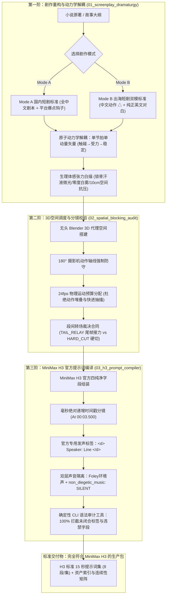

# OmniDirector-H3 (全知导演 H3)
## 专为 MiniMax H3 打造的工业级短剧剧作重构 · 3D空间预演 · 动力学解耦 · 官方多模态编译系统

---

## 一、“OmniDirector” 命名与设计哲学

### 1. 为什么叫 “Omni”？
**"Omni"**（读作 /ˈɒmni/）源自古罗马拉丁语词根 *omnis*，中文意为**“全”、“全知全能”、“无所不包的”**。在科技与哲学领域，它是极致掌控力的象征：
* **哲学与宗教**：*Omniscient*（全知者，洞察万物因果）、*Omnipotent*（全能者，具备无限创造力）；
* **顶级科技平台**：如英伟达旗下的 *NVIDIA Omniverse*（面向全宇宙物理仿真的工业级虚拟现实平台）；
* **商业与工业**：*Omnichannel*（全渠道全链路无缝整合）。

### 2. 为什么叫 “OmniDirector（全知导演）”？
在目前的 AI 视频与短剧创作生态中，大多数创作者停留在“提示词抽卡（Prompt Typers）”阶段——把小说直接丢给 AI，一旦遇到角色肢体融化、多手多脚、男女主左右站位越轴穿帮、台词对不上口型、模型自动胡乱生成嘈杂电音伴奏时，只能束手无策地反复重抽。

**OmniDirector** 将创作者的角色升级为一位**全方位统筹调度的“电影工业级全知总导演”**：
1. **全模态统筹（Omni-Dimensional）**：不再只写干瘪的文本，而是将文学叙事、三维空间几何、24fps 动作动力学、微表情体感与物理拟音（Foley）五维合一。
2. **全场景兼容（Omni-Market）**：原生双模驱动，既提供面向抖音/快手/红果的 **Mode A 国内短剧标准**，又提供面向 ReelShort/DramaBox/TikTok 的 **Mode B 出海短剧双模标准**。
3. **全周期连续（Omni-Consistent）**：在镜头切换之间死守 180° 轴线，对道具破损与伤情建立状态机，并通过 `TAIL_RELAY` 尾帧接力合同确保多集生成永不漂移。

---

## 二、专为 MiniMax H3 大模型深度优化

**本系统的核心编译目标是 MiniMax 旗下的旗舰级音视频多模态大模型——MiniMax H3。**

实测证明，早期市面上流传的“自建中文六大模块”提示词会严重稀释扩散模型底层的 Cross-Attention 注意力，导致切镜时间戳失效、构图变形。OmniDirector-H3 完全重构并严密贴合 **MiniMax H3 官方规范**：

* **官方毫秒绝对时间戳硬切**：在 `integrated_multimodal_description:` 中注入绝对递增时间戳（如 `[Shot 2] At 00:03.500, the camera cuts to...`），让 MiniMax H3 在单个 15 秒片段内精准完成电影级硬切，告别画面融化。
* **官方 `<d>` 发声标签**：将台词严格封装为 `<d> Speaker: "Exact spoken line" </d>`，确保角色说话时动作、口型与声线咬合一致。
* **双层声音隔离铁律**：在提示词尾部强制注入 `non_diegetic_music: SILENT`，彻底阻断模型自动生成劣化合成器配乐，保留极其纯净的对白与环境拟音（Foley），为后续商业配乐混音奠定工业基础。
* **确定性语法审计拦截网**：配套提供 `tools/audit_h3_prompts.py`，在提交前以 0 容忍度排查未闭合标签、非法字符、时间戳非递增等所有隐患。

---


---

## 三、视觉资产与音频资产工程规范

为保障 MiniMax H3 能够稳定锁脸、锁场景光影与咬合声线，系统制定了明确的前置资产输入标准（详见 [`templates/asset_production_spec.md`](templates/asset_production_spec.md)）：

### 1. 视觉资产生成策略 (Visual Assets)
* 🌟 **首选主推 (Primary Recommended)**：在 **Codex** 中调用 **`imagegem`** 生成。
  * *深度优势*：与 AI Agent 提示词上下文原生协同，生成的人物三视图、45° 侧颜及物理受光极度严谨，肤质纹理真实自然，彻底杜绝塑料 CG 质感。
* 🥈 **次选推荐 (Secondary Recommended)**：**`nanonanana`**。
  * *适用场景*：适合作为高概念场景空镜、复杂道具质感与特定影视风格参考图的补充工具。
* **交付硬指标**：
  * **人物参考图**：中立微表情正面 + 45° 侧脸 + 全身服装锁定照；
  * **场景参考图**：纯无人空镜，锁定主光源朝向与环境冷暖基底；
  * **道具参考图**：纯色底微透视，支持完整损伤状态机（如未拆封 $\rightarrow$ 破损撕开）。

### 2. 音频资产生成策略 (Audio Assets)
* 🔇 **生成工具不做推荐 (No Generator Recommended / Open Choice)**：
  * **本系统对音频生成工具不做任何推荐或绑定**。
  * 无论是真人专业配音员实录干音、开源声线模型（VoxCPM, CosyVoice, GPT-SoVITS, F5-TTS）还是商业配音工具（ElevenLabs），创作者均可根据声线贴合度与商用版权完全自选。
* **MiniMax H3 兼容接口参数**：
  * **格式**：无损 **WAV**（单声道 Mono）；
  * **采样率**：标准 **32kHz**（或 44.1kHz / 48kHz）；
  * **纯净度**：**绝对纯干音（Dry Voice）**，禁止带伴奏、底噪与混响（Reverb）；
  * **时长**：5.0 至 15.0 秒，包含 2–3 句带典型语速与情绪起伏的自然台词。
* **视频提示词静音铁律**：视频生成阶段严格锁定 `non_diegetic_music: SILENT`，配乐由成片后期统筹混音。

---

## 四、多平台智能体（AI Agent）适配架构

OmniDirector-H3 深度适配全球主流 AI 智能体平台，开箱即用：

### 1. Anthropic Claude (Claude Code / Claude Projects)
* 仓库根目录下内置 [CLAUDE.md](./CLAUDE.md)，Claude Code 启动时自动载入所有导演工作流与验证规范。
* 在 Claude Projects 中，可直接引入 SKILL.md 作为项目系统提示词。

### 2. OpenAI Codex & ChatGPT Assistants
* 参考 [AGENTS.md](./AGENTS.md) 中的 Codex 系统指令，直接指示 Codex 按照 Mode A/B 规范与 H3 四字段语法自动化生成脚本与分镜。

### 3. Google Antigravity (AGY) / Gemini CLI
* 直接将本项目放入 .agents/skills/omni-director-h3/ 或 ~/.gemini/config/skills/，根目录的 SKILL.md 会被自动注册为系统内置 Skill。

### 4. Cursor / Windsurf / Cline / Roo Code
* 在 .cursorrules 中引入 AGENTS.md 规则，即可在 IDE 中让 AI 实时进行剧本动力学解耦与提示词语法合规校验。

---

## 五、工业三阶全流程智能引擎 (Tri-Tier Core Engine)

本系统的核心职责是**完成从故事剧作到 100% 符合 MiniMax H3 规范的高标准分镜提示词与资产连续性包的编译交付**。



---

## 六、双模式剧作规范 (Mode A 与 Mode B)

### 1. Mode A：国内中文微短剧标准
* **定位平台**：抖音、快手、微信视频号、番茄短剧、红果短剧、爱奇艺随刻等；
* **剧作规范**：
  * **角色名**：地道中文名（如：林舟、陆辰、苏晴）；
  * **动作调度（`△`）**：全中文精准动词，采用“单节拍单矢量”解耦；
  * **对白语言**：地道中文口语，节奏紧凑、反转强烈，符合短视频受众 3 秒留存心理；
  * **模板路径**：[`templates/screenplay_spec_a_domestic_template.md`](templates/screenplay_spec_a_domestic_template.md)。

### 2. Mode B：出海微短剧双模标准
* **定位平台**：ReelShort、DramaBox、ShortMax、TikTok 等出海平台；
* **剧作规范**：
  * **角色名**：国际化英文角色名（如：Cade, Reeve, Nia）；
  * **动作调度（`△`）**：全中文高密度动作指令（便于主创把控与 AI 动量解耦）；
  * **对白语言**：纯正美式/国际英语对白，口语化、含蓄、带停顿与潜台词；
  * **模板路径**：[`templates/screenplay_spec_b_template.md`](templates/screenplay_spec_b_template.md)。

---

## 七、生成执行：由用户完全自主决定

**OmniDirector-H3 的工程边界是交付完美适配 H3 的高标准提示词。**

提示词编译完成后，您可以根据自身团队的软硬件条件，自由选择执行环境：
1. **途径 1：MiniMax 官方 Web 创作端**
   * 直接复制通过审计的 15 秒提示词块，粘贴至 MiniMax 官方网页创作平台进行单条或批量出片。
2. **途径 2：MiniMax 官方开放平台 API**
   * 将提示词包导入您自己的企业自动化工作流或 Python 脚本，直连 MiniMax 官方 REST API。
3. **途径 3：GPU 云端 / 本地 ComfyUI 节点**
   * 在 AutoDL、RunPod 或本地算力服务器中部署 ComfyUI，使用对应的 MiniMax H3 节点批量生成。
4. **途径 4：通宵无人值守批处理参考工具（选配）**
   * 仓库在 `tools/run_overnight_batch.py` 中附带了一套完整的通宵特惠定时批处理参考脚本，支持 00:01:00 唤醒与 `batch_progress.json` 断点恢复，供有自动化批处理需求的高级用户直接调用。

---

## 八、5分钟快速操作指南

```bash
# 1. 克隆仓库
git clone https://github.com/egguy886/OmniDirector-H3.git
cd OmniDirector-H3
chmod +x tools/*.py tools/*.sh

# 2. 编译剧本为 H3 提示词脚手架
python3 tools/compile_screenplay_to_h3.py \
  --input templates/screenplay_spec_a_domestic_template.md \
  --output my_episode_prompts.md

# 3. 运行确定性语法审计（实测 0 语法与标签错误）
python3 tools/audit_h3_prompts.py --input examples/E01_h3_prompts_sample.md

# 4. 运行 Blender 3D 轴线空间预演（可选）
blender --background --python tools/blender_proxy_previz.py -- --episode E01 --render
```

---

## 九、开源许可证
本项目基于 **MIT License** 完全开源。
